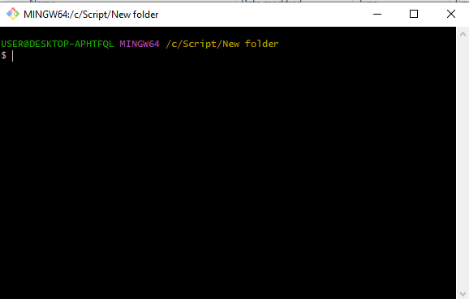

# Deploying Web Server with Ansible Jinja Templates

To get the source code for this lab, you can follow the steps below

---
## Install git

Open git scm (you can install it in the linux terminal, or install git on other platforms here [Download](https://git-scm.com/downloads) )



Type the command git clone "repository link" to get the source code to your local computer
```
$ git clone https://github.com/zaxrmdn/DeployNginx-JinjaAnsible.git
```

Check if the code is already in local storage


---
## Open Resource Lab

Go to the directory code
.png)


The files looks like this below
.png)

To trying the playbook, running this command below
```
$ ansible-playbook -i inventory playbook/web-pub.yml
```
